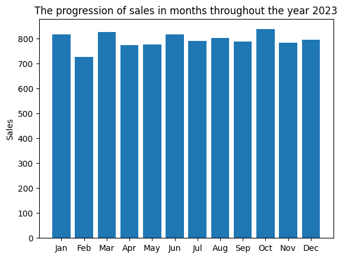

# Analysis Report

I think the only meaningful and impactful analysis we can do has the transaction date column at its center. We can make analysis on:
- The progression of sales (transactions) through time.
- Which months produced the lowest and the highest sales.
- If there was a gradual shift in payment method or location.
- Overall relation between each column and transaction date.

### Progression of sales

- The month with the **lowest** sales is **February with 727 sales**.
- The month with the **highest** sales is **October with 838 sales**.
- The **range** of the montly sales is **111**.
    - But this is affected by the fact that October is a month of 31 days while February is just 28 days. If we were to add three more days worth of sales to the month February by taking the average sales per day 26 and multiply it by 3, then the sales in February would become 805, shrinking the range down to just 33.
- The **standard deviation** of the monthly sales is 28.24, meaning the maximum possile range of sales is, on average, around $28.24\times2=56.48$

**The Verdict**: We cannot extract any critical insight from the monthly progression of sales because they seem not to vary significantly in a way it implies for the existence of some hidden reasons/patterns.
