# Cafe Sales — Data Cleaning Report

## At a Glance

This dataset records **10,000 café transactions** from 2023 — what was ordered, how much was spent, how the customer paid, and whether they ordered in-store or takeaway. The raw file was heavily incomplete: roughly **70% of rows** had at least one missing value, including placeholder text (`UNKNOWN`, `ERROR`) instead of real blanks. Through a careful two-phase approach — first recovering values we could prove with math, then making deliberate best-guess decisions — the dataset was reduced to **9,064 complete, trustworthy rows** exported as `data/clean.csv`.

## Who Would Use This Data?

- **Café owner / manager:** Build a sales dashboard showing daily revenue, popular items, and payment-method trends across locations.
- **ML engineer / data scientist:** Train demand-forecasting models to predict popular items by time of day, month, or location (In-store vs Takeaway).
- **Web developer:** Integrate cleaned transaction data into a point-of-sale admin panel or customer-facing order history page.
- **Inventory planner:** Analyze quantity patterns per menu item to optimize stock levels throughout the year.

## About the Dataset

- **Source:** [Kaggle — Cafe Sales Dirty Data for Cleaning Training](https://www.kaggle.com/datasets/ahmedmohamed2003/cafe-sales-dirty-data-for-cleaning-training). Loaded from `data/raw.csv`.
- **Size:** **10,000 rows × 8 columns** (raw) → **9,064 rows × 8 columns** (final)

| Column | What it means |
|--------|---------------|
| `Transaction ID` | Unique identifier for each sale |
| `Item` | Menu item ordered |
| `Quantity` | Number of items purchased (1–5) |
| `Price Per Unit` | Price of one item in USD |
| `Total Spent` | Total amount paid (Quantity × Price Per Unit) |
| `Payment Method` | Credit Card, Cash, or Digital Wallet |
| `Location` | In-store or Takeaway |
| `Transaction Date` | Date of the sale (2023) |

**Fixed menu prices** (each item always costs the same):

| Item | Price (\$) |
|------|-----------|
| Coffee | 2.00 |
| Tea | 1.50 |
| Sandwich | 4.00 |
| Salad | 5.00 |
| Cake | 3.00 |
| Cookie | 1.00 |
| Smoothie | 4.00 |
| Juice | 3.00 |

Note: Cake and Juice both cost \$3; Sandwich and Smoothie both cost \$4 — this ambiguity matters during cleaning.

## What Was Wrong With the Raw Data?

- **Everything stored as text:** Numbers and dates were read as strings, not proper numeric or date types.
- **Placeholder values:** `UNKNOWN` and `ERROR` appeared instead of blank cells — converted to standard missing values (NaN).
- **Widespread missing data:** 6,911 of 10,000 rows (≈70%) had at least one missing field.
- **Worst-affected columns:** Location (39.6% missing), Payment Method (31.8%), Item (9.7%).
- **Recoverable relationships ignored in raw data:** Item maps to a fixed price; Total = Quantity × Price — these rules were not applied in the source file.

### Initial missing-value counts (after UNKNOWN/ERROR → NaN)

| Column | Missing | % Missing |
|--------|---------|-----------|
| Transaction ID | 0 | 0% |
| Item | 969 | 9.7% |
| Quantity | 479 | 4.8% |
| Price Per Unit | 533 | 5.3% |
| Total Spent | 502 | 5.0% |
| Payment Method | 3,178 | 31.8% |
| Location | 3,961 | 39.6% |
| Transaction Date | 460 | 4.6% |

## Cleaning Process

### Phase 1 — Certain deductions (100% confidence)

These steps recover values that *must* be correct based on known rules — no guessing involved.

1. **Data type conversion** — Converted Quantity, Price Per Unit, and Total Spent to numbers; Transaction Date to proper dates.

2. **Validation checks (all passed)** — Confirmed no out-of-menu items, no zero/negative quantities, no invalid prices outside the fixed menu, and dates spanning 366 unique days in 2023.

3. **Item → Price mapping (1st round)** — Used the fixed menu to fill missing prices from known items. Price Per Unit missing: **533 → 54**.

4. **Price → Item mapping (1st round, partial)** — Reverse-mapped price to item for unambiguous prices only (\$1→Cookie, \$1.50→Tea, \$2→Coffee, \$5→Salad). **Skipped prices \$3 and \$4** because Cake/Juice and Sandwich/Smoothie share those prices. Item missing: **969 → 501**.

5. **Quantity × Price = Total (arithmetic deduction)** — Used the formula in all directions to recover missing values:

    | Column | Before | After | Recovered |
    |--------|--------|-------|-----------|
    | Total Spent | 502 | 23 | 479 |
    | Quantity | 479 | 23 | 456 |
    | Price Per Unit | 54 | 6 | 48 |

6. **Item → Price mapping (2nd round)** — With more prices now known, deduced **21 more items**. Item missing: **501 → 480**.

7. **Validation loops** — Confirmed zero remaining mismatches between item/price and quantity/price/total combinations.

**Post-deduction state:**

| Column | Missing |
|--------|---------|
| Item | 480 |
| Quantity | 23 |
| Price Per Unit | 6 |
| Total Spent | 23 |
| Payment Method | 3,178 |
| Location | 3,961 |
| Transaction Date | 460 |

**Key certainty finding:** The 480 remaining missing items are guaranteed to be one of **Cake, Juice, Sandwich, or Smoothie** — but we cannot tell which one for each row.

```mermaid
flowchart LR
  raw["raw.csv (10,000 rows)"] --> types["Type conversion"]
  types --> itemPrice["Item ↔ Price deduction"]
  itemPrice --> arithmetic["Qty × Price = Total"]
  arithmetic --> itemPrice2["2nd Item ↔ Price round"]
  itemPrice2 --> checkpoint["Checkpoint: certainty ends"]
  checkpoint --> impute["Imputation decisions"]
  impute --> final["clean.csv (9,064 rows)"]
```

### Checkpoint — where certainty ends

Everything recovered so far is **provably correct**. Further cleaning requires educated guesses that may not match reality. From here, the strategy shifts to imputation (filling missing values) or dropping rows.

### Phase 2 — Imputation and row removal (best-guess decisions)

8. **Item — drop, don't guess** — The 480 missing items cannot be reliably assigned (Cake vs Juice at \$3; Sandwich vs Smoothie at \$4). Exploratory analysis (e.g. January shows ~62% of price-\$4 sales are Sandwiches) was deemed insufficient — filling would affect only ~14 values but risk being wrong. **Dropped all 480 rows** with missing Item → **9,520 rows**.

9. **Location and Payment Method — fill with "Unspecified"** — Rather than guessing patterns (e.g. linking location to order size), filled missing values with the label **"Unspecified"**. **5,567 rows** affected.

10. **Quantity and Total Spent — drop double-missing** — **20 rows** where both Quantity and Total Spent were missing were dropped → **9,500 rows**.

11. **Transaction Date — drop undated rows** — **436 rows** with no date were dropped (264 of these already had Unspecified location and/or payment) → **9,064 rows**.

12. **Finalization** — Cast Quantity to integer; confirmed **0 duplicates**. Exported to `data/clean.csv`.

### Overall NaN recovery summary

| Column | Initial Missing | After Deduction | Final Missing | Recovery |
|--------|----------------|-----------------|---------------|----------|
| Transaction ID | 0 | 0 | 0 | — |
| Item | 969 | 480 | 0 (480 dropped) | 50.5% deduced |
| Quantity | 479 | 23 | 0 | 95.2% deduced |
| Price Per Unit | 533 | 6 | 0 | 98.9% deduced |
| Total Spent | 502 | 23 | 0 | 95.4% deduced |
| Payment Method | 3,178 | 3,178 | 0 (filled "Unspecified") | — |
| Location | 3,961 | 3,961 | 0 (filled "Unspecified") | — |
| Transaction Date | 460 | 460 | 0 (436 dropped) | — |

## Key Results

| Metric | Value |
|--------|-------|
| Rows before / after | 10,000 / 9,064 |
| Total rows dropped | 936 (480 item + 20 qty/total + 436 date) |
| Rows with "Unspecified" location or payment | 5,567 |
| All 8 columns fully populated | Yes (9,064 non-null each) |
| Duplicate transactions | 0 |

**Initial numeric stats (raw data):**

| | Quantity | Price Per Unit | Total Spent |
|---|----------|----------------|-------------|
| Mean | 3.03 | 2.95 | 8.92 |
| Min | 1 | 1.00 | 1.00 |
| Max | 5 | 5.00 | 25.00 |

## Output Files

| File | Description |
|------|-------------|
| `data/raw.csv` | Original messy input |
| `data/clean.csv` | Final cleaned dataset (9,064 rows × 8 columns) |

## Notebook

Full step-by-step code and outputs: [`01_data_cleaning.ipynb`](01_data_cleaning.ipynb)
