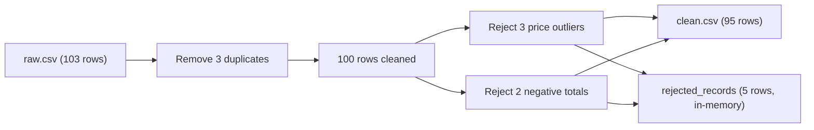

# Messy E-Commerce Sales — Data Cleaning Report

## At a Glance

This dataset contains **103 online store orders** — products, prices, quantities, payment methods, and delivery status. The raw file was deliberately messy: duplicate orders, extra spaces in column names, mixed date formats, non-numeric prices, wrong product categories, and a few clearly broken records. After cleaning, **95 trustworthy orders** remain in the main dataset, with **5 bad orders** set aside in a separate rejected-records log. Missing values were left empty on purpose — filling them in would require guesses this sales dataset doesn't support.

## Who Would Use This Data?

- **Store owner / operations manager:** Review order history, revenue totals, and product-category breakdowns in a sales dashboard.
- **Web developer:** Build an order management UI or admin panel showing clean order records with standardized dates and categories.
- **ML engineer / data scientist:** Limited use for price/quantity prediction — **20 of 95 rows still have missing values** because interpolation was intentionally skipped. Better suited for category analysis or order-status reporting.
- **Data quality auditor:** Study the rejected-records workflow as a template for flagging bad data instead of silently deleting it.

## About the Dataset

- **Source:** [Kaggle — Messy E-Commerce Sales Dataset](https://www.kaggle.com/datasets/kandeelai22/messy-e-commerce-sales-dataset). The notebook notes the data is **synthetic** (customer names follow a `Customer_{ID}` pattern). Loaded from `data/raw.csv`.
- **Size:** **103 rows × 11 columns** (raw) → **95 rows × 11 columns** (final)

| Column | What it means |
|--------|---------------|
| `ID` | Row identifier |
| `Customer_Name` | Customer label (e.g. Customer_101) |
| `Order_ID` | Unique order code (e.g. ORD-35783) |
| `Order_Date` | When the order was placed |
| `Product` | Item ordered (Laptop, T-Shirt, Basketball, etc.) |
| `Category` | Product group: Books, Clothing, Electronics, Home, or Sports |
| `Quantity` | Number of items ordered |
| `Price` | Unit price in USD |
| `Payment_Method` | How the customer paid |
| `Status` | Order status: Delivered, Shipped, Processing, Cancelled, or Returned |
| `Total` | Total order amount in USD |

## What Was Wrong With the Raw Data?

- **Duplicate orders:** 3 rows shared the same `Order_ID`.
- **Messy column names:** Leading spaces on ` Customer_Name` and ` Category`.
- **Mixed date formats:** One date written as `Jan 5 2023` instead of `MM/DD/YYYY`; one value was literally `abc`.
- **Non-numeric quantities:** Values like `-2`, `-5`, `4a` couldn't be parsed as whole numbers.
- **Non-numeric prices:** Values like `abd`, `four hundred`, `300$`, `-100`.
- **Inconsistent text casing:** `electronics` vs `Electronics`; `Electronic` (singular) vs `Electronics`.
- **Broken math:** 9 rows where Quantity × Price ≠ Total (kept — tax, shipping, or discounts may explain the gap).
- **Price outliers:** 3 orders with implausible prices (e.g. blender at \$38, laptop at \$69.48, blender at \$10,000 with total −\$20,000).
- **Negative totals:** 2 orders with negative total amounts and no Return/Refund status.
- **Product–category mismatches:** 6 products assigned to the wrong category (e.g. Basketball listed under Books).

## Cleaning Process

The notebook follows a **ROMI** framework: **R**elation checks → **O**utlier handling → **M**ismatch fixes → **I**nterpolation (skipped).

1. **Duplicate removal** — Dropped **3 rows** with duplicate `Order_ID` values → **100 rows** remain.

2. **Column name cleanup** — Stripped leading/trailing spaces from all column headers.

3. **Rejected-records tracker** — Created an in-memory log to capture bad rows with a `Reject_Reason` before removing them (audit trail instead of silent deletion).

4. **Order date parsing** — Converted dates to standard format. **2 values** couldn't be parsed (`Jan 5 2023` was fixed; `abc` became missing).

5. **Quantity type conversion** — Non-digit values (including negatives and text like `4a`) set to missing; column converted to nullable integer.

6. **Price type conversion** — Non-numeric values set to missing; column converted to float.

7. **String formatting** — Stripped whitespace; applied title case to product, category, payment method, and status fields.

8. **Category fix** — Corrected `Electronic` → `Electronics`.

9. **Relation check (Quantity × Price = Total)** — Found **9 rows** where the math doesn't add up. **Kept all 9 unchanged** — without business rules for tax, shipping, or discounts, changing them would be guessing.

10. **Price outlier rejection** — Identified 3 orders with prices below \$100 (excluding Shoes at \$40.95, which is plausible) or above the statistical upper bound (\$1,204.75). Moved **3 orders** to rejected records with reason `Outlier Price`:
    - ORD-41285, ORD-64136, ORD-72751 (the last had price \$10,000 and total −\$20,000 — clearly broken)

11. **Negative total rejection** — Moved **2 orders** with negative totals and no Return/Refund status to rejected records with reason `Negative Total`:
    - ORD-16585, ORD-91254

12. **Product–category mismatch fix** — Mapped 6 products to their correct categories:

    | Product | Correct category |
    |---------|-----------------|
    | Basketball | Sports |
    | Lamp | Home |
    | Microwave | Home |
    | T-Shirt | Clothing |
    | Vacuum | Home |
    | Yoga Mat | Sports |

    After fixing: **0 mismatches** remain.

13. **Interpolation — skipped** — Missing prices and quantities were **not filled in**. For a sales dataset, guessing missing financial values would introduce unreliable data.

## Key Results

| Metric | Before | After |
|--------|--------|-------|
| Rows | 103 | 95 |
| Duplicate orders | 3 | 0 |
| Rejected orders | — | 5 (3 price outliers + 2 negative totals) |
| Price range | \$38 – \$10,000 | \$40.95 – \$978.63 |
| Total range | −\$20,000 – \$4,722.70 | \$40.95 – \$4,722.70 |
| Mean order total | — | ~\$1,581 |
| Rows with ≥1 missing value | — | 20 |

**Missing values in final dataset (intentionally kept):**

| Column | Missing |
|--------|---------|
| Order_Date | 1 |
| Category | 6 |
| Quantity | 6 |
| Price | 9 |
| Total | 14 |

**Before vs after examples:**

| Order | Field | Before | After |
|-------|-------|--------|-------|
| ORD-35783 | Price | `abd` | missing |
| ORD-77417 | Order_Date | `Jan 5 2023` | `2023-01-05` |
| ORD-12270 | Category | `electronics` | `Home` |

## Output Files

| File | Description |
|------|-------------|
| `data/raw.csv` | Original messy input |
| `data/clean.csv` | Final cleaned dataset (95 rows, dates as YYYY-MM-DD) |
| Rejected records | **5 rows tracked in memory only** — not exported to a file |

## Notebook

Full step-by-step code and outputs: [`05_data_cleaning.ipynb`](05_data_cleaning.ipynb)
